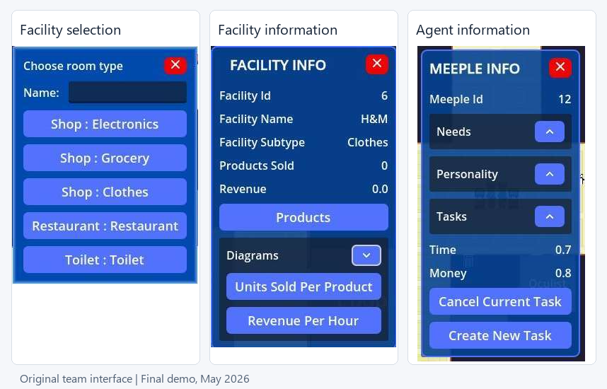
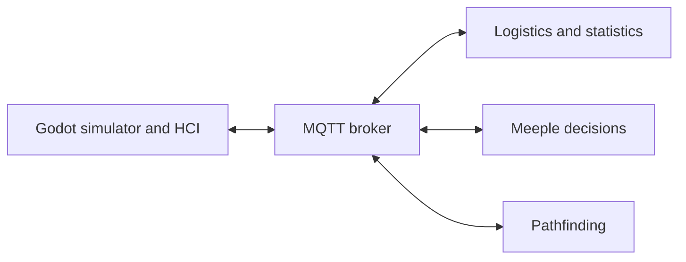

# Integrated Project Work — Modular Simulation System

A team-developed mall simulation from Integrated Project Work at Örebro University. Autonomous agents, called meeples, move through a mall and interact with facilities. A Godot application displays the simulation and connects user actions to separate agent-decision, pathfinding and logistics modules through MQTT.

**My role:** Feature development, UI integration and testing within the simulator/HCI module  
**Simulator technologies:** Godot, GDScript, C#/.NET, MQTT, JSON, GUT and GitHub Actions

*The team-developed interface.*

## The project

Users can create and inspect facilities and agents, navigate into facilities, change agent tasks, adjust product prices and restocking, and view statistics. The interface also supports simulation time and floor switching.

[See the final-demo features and statistics screenshot](docs/final-demo.md).

## System architecture

The modules exchange requests and updates as MQTT messages with JSON payloads. Within Godot, views and controllers coordinate user input, information displays and shared simulation state.

[Read the architecture and interaction flows](docs/architecture.md).

## My contributions

| Area | My contribution |
|---|---|
| Facility selection | Implemented the initial facility-type popup, generated selection buttons, connected selection and cancellation signals, and added GUT tests. |
| HUD navigation | Added view-dependent controls, facility information and the return-to-mall interaction, with tests for the revised HUD behavior. |
| Click interactions | Used single-click for information requests and double-click to enter a facility. Added checks for unknown facilities and facilities without an interior view. |
| UI reliability | Fixed duplicate menu signal connections and added or maintained popup and controller tests. |
| Base UI theme | Introduced the initial button and popup theme, which teammates subsequently expanded. |
| Collaborative UI work | Co-developed information popups, the burger menu and the final visual design with teammates. |
| Collaborative integration | Helped connect information panels to MQTT data, wire facility selection to naming and placement, and maintain tests after refactoring. |

The initial implementations above evolved through later team contributions. The final interface screenshots show that shared result.

## Runnable code example

[Facility selection example](examples/facility-selection/README.md): a standalone Godot adaptation of my original selector, with generated buttons, selection/cancellation signals and GUT tests. It includes a small application that runs independently of the original system.

The example passed **3 tests with 11 assertions** locally. Its documentation includes run instructions and explains the adaptations; a separate GitHub Actions workflow is configured to run its tests.

## Testing in the original project

I added and maintained GUT tests for interface elements and controllers, including popup signals, facility selection and HUD behavior. The team's GitHub Actions workflow, developed by teammates, built the C# project and ran GUT on pull requests to `main`.

## Project credit

The HCI team consisted of Abdulrahim Kuteifan, Jesper Tsuranov, Milkias Michael Teklesenbet, Sarah Wattar and Taiba Abdul Karim. I also collaborated with Hoda Saleh on facility-spawner integration. Additional contributors developed the shared simulator and the other modules.

The simulation engine, agent movement, facility renderer, chart implementation and MQTT client were developed by other contributors or jointly within the project. The original-interface screenshots are team work; the chart renderer was principally developed by Milkias.

This repository contains the case study and a standalone adaptation of my selector. The complete system remains in the private course repositories.
