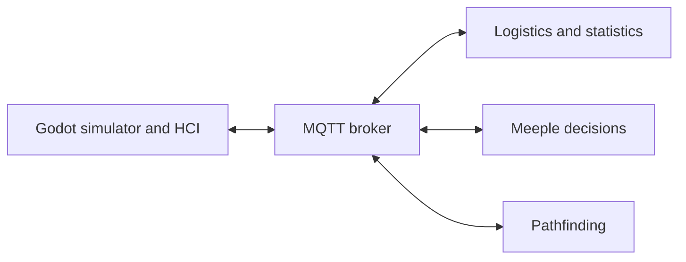

# Integrated Project Work — Modular Simulation System

A team-developed mall simulation from Integrated Project Work at Örebro University. The project combines a visual simulator, agent decisions, pathfinding and logistics through MQTT messaging.

This case study presents the system architecture and my contributions to feature development, UI integration and testing within the simulator/HCI module.

**My role:** Feature development, UI integration and testing  
**Simulator technologies:** Godot, GDScript, C#/.NET, MQTT, JSON, GUT and GitHub Actions

## The project

The system simulates autonomous agents, called meeples, moving through a mall and interacting with facilities. Separate modules handle agent decisions, pathfinding and logistics, while a Godot application displays the simulation and provides the user interface. The modules exchange data through MQTT.

The interface lets users create facilities, inspect agents and facilities, navigate between mall and facility views, and view information received from the other modules.

## System architecture

The separate modules exchange requests and updates as MQTT messages with JSON payloads. Within Godot, views and controllers coordinate user input, information displays and shared simulation state.

The complete system was developed collaboratively across multiple repositories. My work focused on HCI features and their integration with the shared simulator.

[Read the architecture and interaction flows](docs/architecture.md).

## My contributions

| Area | My contribution |
|---|---|
| Facility selection | Implemented the initial facility-type popup, generated selection buttons, connected selection and cancellation signals, and added GUT tests. |
| HUD navigation | Added controls that change with the current view, including facility information and a return to the mall view. |
| Click interactions | Refined facility navigation so a single click requests information and a double-click enters the facility view. Added checks for facilities without an interior view. |
| UI reliability | Fixed duplicate signal connections when the menu refreshed and added or maintained tests for popup and controller behavior. |
| Collaborative integration | Co-developed information popups, MQTT-backed UI flows, menu behavior and the final visual design with teammates. |

[Read the contribution details and evidence](docs/contributions.md).

## Code example

[Facility selection example](examples/facility-selection/README.md): a standalone Godot adaptation of my original selector, with its scene, signal handling and GUT tests. It includes a small application to exercise the feature independently of the full project.

The example documentation identifies its original source commits and the adaptations made for this showcase. Its tests have a separate GitHub Actions workflow.

## Example features

**Inspecting and entering a facility are separate actions.** A single click requests facility information. A double-click opens its interior view, allowing users to inspect a facility before navigating into it.

**Available actions depend on the current view.** The facility view presents relevant information and an exit action. Returning to the mall restores the mall controls.

**UI events connect to simulation data.** Godot signals coordinate interface interactions, and MQTT messages connect information requests and updates to the other project modules.

## Integration and testing

My collaborative work included connecting user interactions and information panels to messages exchanged with Logistics and Meeple Brain. This required coordinating selections, requests, responses and view state within the shared application.

I added and maintained GUT tests for interface elements and controller behavior, including facility selection, popup signals and HUD interactions. The team's GitHub Actions workflow built the C# project and ran GUT automatically on pull requests to `main`.

## What I learned

- Coordinating interface behavior through Godot signals and shared application state.
- Connecting independently developed components through MQTT and JSON messages.
- Testing UI behavior as the surrounding code changed during team development.
- Integrating feature changes into a codebase with multiple contributors.

## Project credit

This was a university team project. The contribution table describes my individual implementations and my collaborative work. The simulation engine, back-end modules, chart renderer, MQTT client and automated testing workflow were developed by other team members or jointly within the project.

This repository contains the case study and a standalone adaptation of one of my features. The complete original system is hosted in private course repositories.
