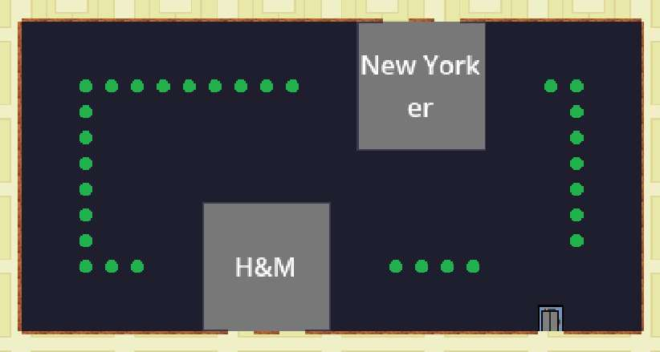
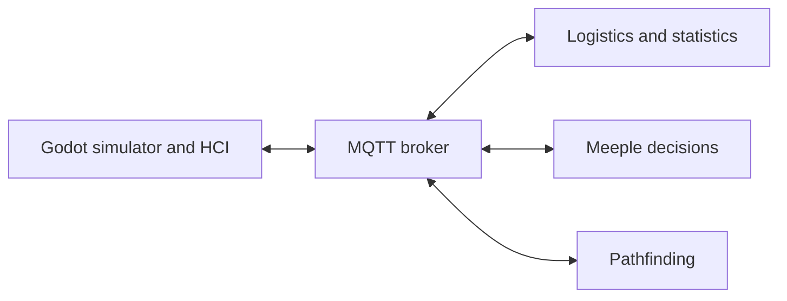

# Integrated Project Work — Modular Simulation System

A team-developed mall simulation from Integrated Project Work at Örebro University. Autonomous agents, called meeples, move through a mall and interact with facilities. A Godot application displays the simulation and connects user actions to separate agent-decision, pathfinding and logistics modules through MQTT.

**My role:** Feature development, UI integration and testing within the simulator/HCI module  
**Simulator technologies:** Godot, GDScript, C#/.NET, MQTT, JSON, GUT and GitHub Actions

*The team-developed mall view during facility creation.*

## The project

Users can create and inspect facilities and agents, enter facilities, change agent tasks, adjust product prices and restocking, and view statistics. Simulation time and floor controls support navigation.

[See the interface panels and final-demo features](docs/final-demo.md).

## System architecture

The modules exchange requests and updates as MQTT messages with JSON payloads. Within Godot, signals, controllers and shared state coordinate interface actions and simulation behavior.

[Read the architecture and interaction flows](docs/architecture.md).

## My contributions

| Area | My contribution |
|---|---|
| Facility selection | Implemented the initial facility-type popup, generated selection buttons, connected selection and cancellation signals, and added GUT tests. |
| HUD navigation | Added view-dependent controls and the return-to-mall interaction, with tests for menu behavior and facility-state resets. |
| Click interactions | Used single-click for information and double-click to enter a facility, with guards for unknown facilities and unavailable interiors. |
| UI reliability | Fixed duplicate menu signal connections and added or maintained popup and controller tests. |
| Collaborative integration | Co-developed information popups, MQTT-backed UI flows, facility naming and placement integration, the burger menu and final visual design. |

The initial implementations above evolved through later team contributions. The screenshots show the shared result.

## Engineering challenge: changing views consistently

Facility navigation had to keep the selected entity, menu actions and information requests aligned with the active view. I separated inspection from entry, added facility-specific HUD actions, and reset facility state and stopped its information request when returning to the mall. GUT tests checked the menu actions in each view and the state reset on exit.

## Code and testing

[Facility selection example](examples/facility-selection/README.md): a standalone Godot adaptation of my original selector, with generated buttons, selection/cancellation signals and GUT tests.

It passed **3 tests with 11 assertions** locally. GitHub Actions runs its tests on pushes and pull requests. The example README explains how to run it and what was adapted.

In the original project, I also added and maintained popup and HUD tests within the team's automated testing workflow.

## Project scope

This case study includes a standalone adaptation of my selector. The complete team system remains in private course repositories.
