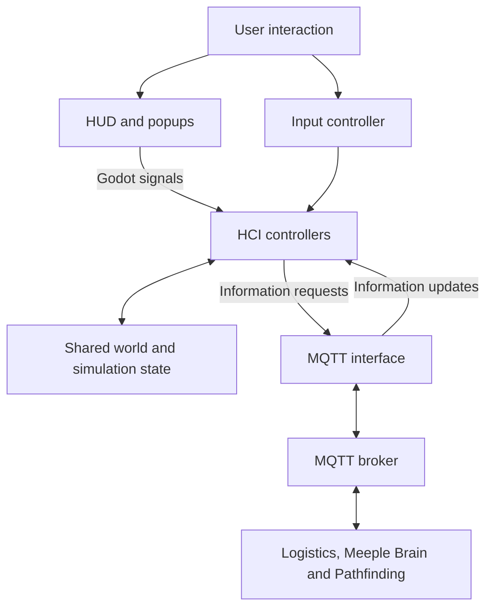

# Architecture and interaction flows

The project uses Godot for the visual simulation and HCI. Logistics, Meeple Brain and Pathfinding are separate modules connected through MQTT.

## Inside Godot

The HCI follows an adapted Model-View-Controller structure. Views display information and emit user-action signals. Controllers coordinate these actions and incoming module data.

| Component | Responsibility |
|---|---|
| HUD controller | Connects menu and popup signals to interface actions and information requests. |
| Input controller | Handles clicks in the simulation, entity selection and facility navigation. |
| MQTT controller | Manages information requests and processes incoming data for the displays. |
| Shared controller state | Holds selected entities, the active facility view and the current chart. |

## Interaction flows

- **Create a facility:** choose a type and name, then select a position. The HUD and input controllers pass the selection to the simulator's facility spawner. I implemented the initial selector and its tests; naming and placement integration involved multiple contributors.
- **Inspect an entity:** a single click identifies a facility or meeple and requests its information from the relevant module. Incoming data is validated and formatted for the display; chart data has its own validation path.
- **Enter and leave a facility:** double-click enters an available interior and changes the HUD actions. On exit, the interface clears facility state, stops the relevant information request and restores the mall controls. This combines my navigation and HUD work with the team's renderer and information integration.

## Communication tradeoff

MQTT carries messages between the separate modules. HCI and the simulation share a Godot project, so local interactions also use signals, direct calls and shared state. This made integration easier, but increased coupling between those components. The team's final report identifies clearer interfaces between HCI and simulation as a future architectural improvement.
