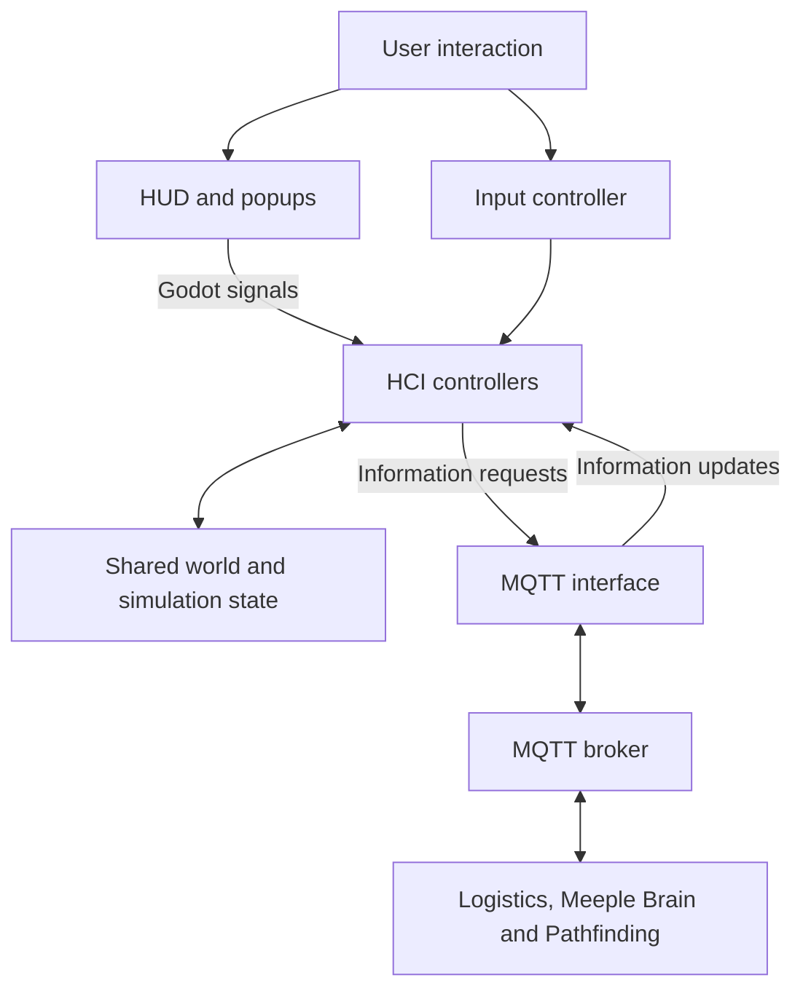

# Architecture and interaction flows

The project uses a Godot application for the visual simulation and HCI. Logistics, Meeple Brain and Pathfinding run as separate modules, with MQTT carrying requests and updates between them.

## Within the Godot application

The interface is organized around views and controllers. Views include the HUD, facility selector and information popups. Controllers coordinate input, the selected entity, the active view and information requests. A shared world model holds simulation state.

`HUDController` handles interface actions, `InputController` handles clicks in the simulation, and `MQTTController` processes incoming data for the displays. A separate `Controller` script holds shared interaction state, such as the selected entity and active facility view.

The diagram shows responsibilities and the main communication paths. My contributions focused on the HCI views, parts of the input and HUD behavior, and collaborative integration with the existing MQTT interface.

## Facility selection

1. The user selects the facility creation action.
2. The facility-type popup displays selection buttons.
3. Choosing a type emits a signal carrying the selection to the controller.
4. The placement interaction hands the selected facility data to the simulator's facility spawner.

I implemented the original selector and its selection/cancellation flow. Later category handling, naming and placement integration involved multiple contributors.

## Inspecting a facility

A single click identifies the selected facility. The HCI requests its information from Logistics over MQTT, and the returned data is presented through the shared information interface.

## Entering and leaving a facility

A double-click requests entry into the facility view. The input handler checks that the facility exists and supports an interior view. The HUD then switches to the facility actions.

The exit action closes the interior, stops the relevant information request, resets the active facility and restores the mall menu. This interaction combines my navigation and HUD work with the team's facility renderer and MQTT integration.
