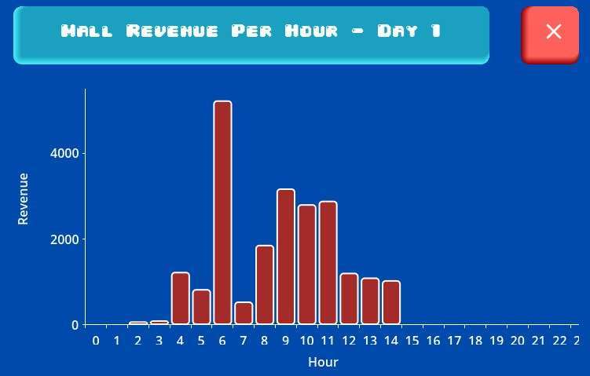

# Final demo

The original team interface provides controls for creating, inspecting and modifying the mall simulation.

## Features presented

| Area | Behavior |
|---|---|
| Facilities | Choose a name and type, place a facility on the map, or select one for deletion. |
| Agents | Create meeples immediately or at a configured hourly rate; select a meeple for deletion. |
| Information | Inspect individual meeples and facilities, or open aggregate mall statistics. |
| Agent tasks | Create a new task or cancel the currently assigned task through the meeple panel. |
| Products | View stock and prices, change prices and request restocking through a facility's product panel. |
| Charts | Open mall-level or facility-level statistics charts. |
| Navigation | Use a persistent menu, see simulation time and switch between floors. The menu changes inside a facility. |

## Statistics view

The figures are simulation outputs. The chart implementation was team work; my contribution concerned shared UI styling and integration.

The screenshots come from the HCI team's final demo and report. These are features of the complete original system; [my contributions](../README.md#my-contributions) and the standalone code example are described in the README.
